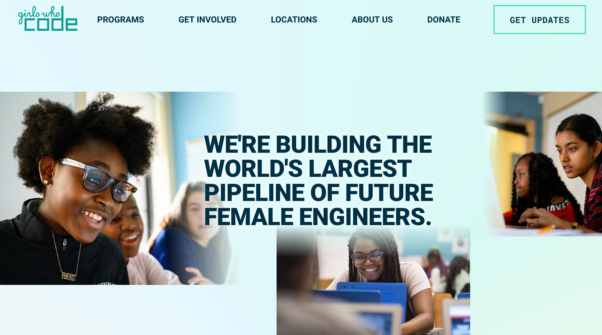
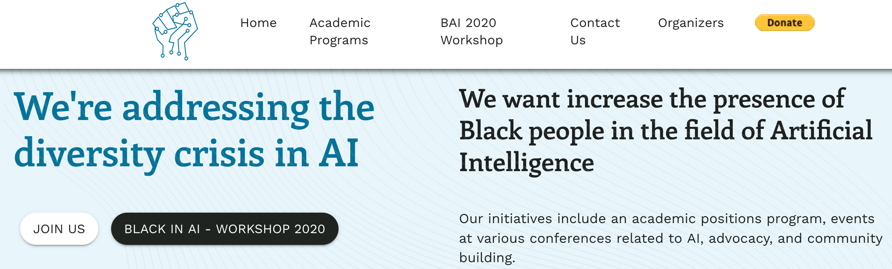
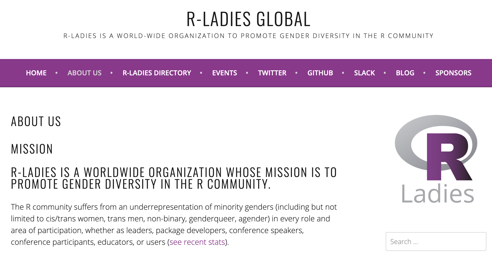
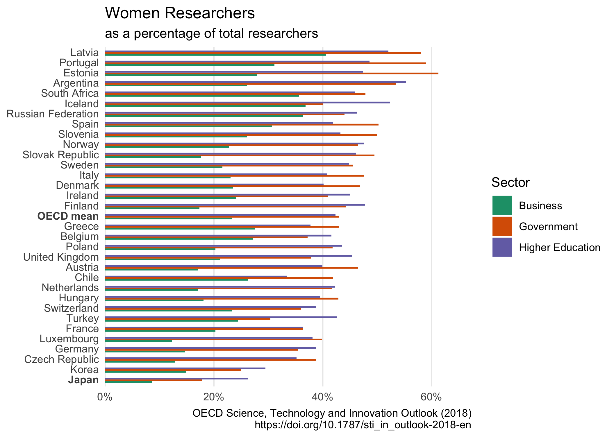
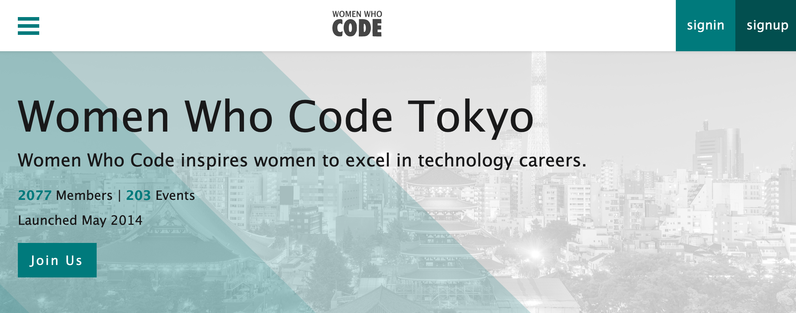
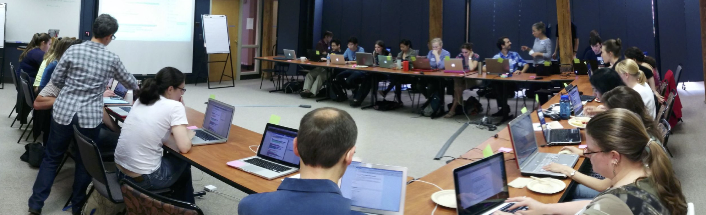
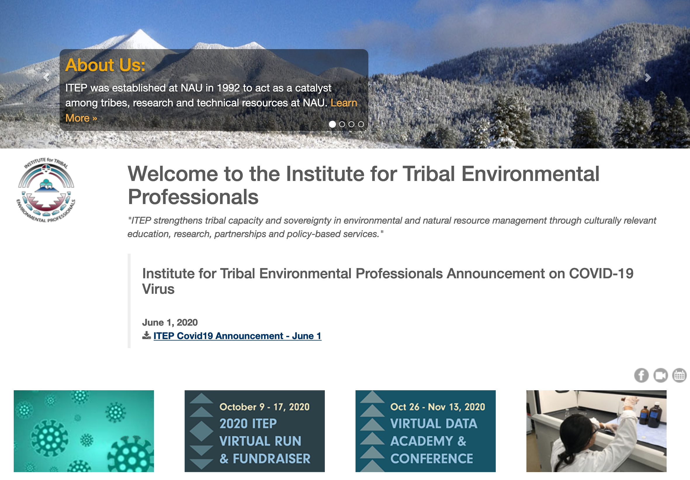
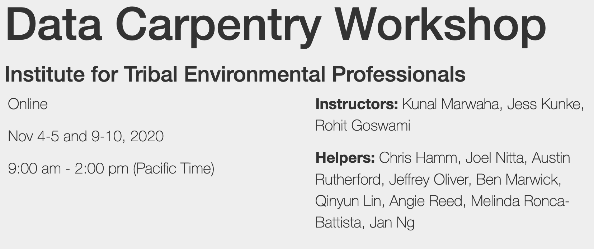

class: title-slide
background-image:url(images/title-image-2.png)
background-size: 35%
background-position: 90% 75%

# Increasing Diversity in STEM   with the Carpentries

 
## Joel H. Nitta

Iwasaki Lab, The University of Tokyo 
https://joelnitta.com
2020.12.10

---
## AIと社会 AI in society

- 人工知能(AI)はもはや普遍的になりつつある Artificial Intelligence (AI) pervades our lives

- AIには**バイアス**がある AI is **biased**

- バイアスはSTEMにおいてダイバーシティーが欠けていることに由来する Bias is due to **lack of diversity in STEM**

---
### 問題解決にむけて頑張っているグループ

Various groups are trying to remedy this: [Girls Who Code](https://girlswhocode.com/)

---
### 問題解決にむけて頑張っているグループ

Various groups are trying to remedy this: [Black in AI](https://blackinai2020.vercel.app/)

---
### 問題解決にむけて頑張っているグループ

Various groups are trying to remedy this: [R-Ladies](https://rladies.org/)

---
日本は特にSTEMにおけるジェンダーバランスが悪い STEM particularly lacks gender diversity in Japan

---
### 日本で問題解決にむけて頑張っている グループ

(Some) groups are trying to remedy this in Japan: [Women Who Code Tokyo](https://www.womenwhocode.com/tokyo)

---
class: middle

# Software Carpentry can help!

---

## Software Carpentry (SWC) とは？

.middle[
- 無償でコードを教えるワークショップ A free coding workshop

- ボランティアによって運営されている Run by volunteers

- 研究者にコードのベストプラクティスを教える Teaches academic researchers best practices

]

.center[https://software-carpentry.org/]

---
# Mission

<blockquote>
<i>"To build global capacity in essential data and computational skills
for conducting efficient, open, and reproducible research. <b>We train and foster an active,
inclusive, diverse community</b> of learners and instructors that promotes and models the
importance of software and data in research. We collaboratively develop openly-available
lessons and deliver these lessons using evidence-based teaching practices. We focus on
people conducting and supporting research"</i>
</blockquote>

---
class: middle

### <i>Diversity is our Goal. Equity, Inclusion, & Accessibility is how we get there.</i>

\- Tracy Teal, Executive Director, The Carpentries

---
## ワークショップの例 Example Workshop

.pull-left[
[Institute for Tribal Environmental Professionals, 2020](https://marwahaha.github.io/2020-11-04-ITEP-online/): アメリカ先住民にデータスキルを教える Teach tribal leaders analysis skills
]

.pull-right[

]

---

### 1796 workshops in 54 countries since 2012

---

## SWCの解決法 SWC's solution

- 研究者が**コミュニティを作って**、互いに教え合う
Researchers teach each other as a **community**

- フィードバックを重視する　Place value on feedback

- 二日間にわたるワークショップ Two-day workshop

- ３−４レッスンを教える　Cover 3-4 lessons

.center[]

---

## ワークショップ Workshops

- 誰でも参加できる Open to anyone

- 無料か少額 Free or small charge for catering/venue

- ワークショップ前後にアンケートを実施 Survey before and after workshop

- 改善のためのフィードバックは重視されている Feedback is important to improve workshops

.center[]

---

## ワークショップ Workshops

スケジュールの例 Example schedule

（最近はオンラインになって、数日に渡って2-3時間ずつ） (Recently, online sessions are 2-3 hours per day over several days)

<!-- schedule from https://edbennett.github.io/2020-02-25-cardiff/-->
.center[]

---

## ザ・カーペントリーズ The Carpentries

Data Carpentry, Library Carpentry, Software Carpentry

---
## インストラクター Instructors

- ボランテイア Volunteers

- 合格するためには講習への参加と模擬授業の試験を受ける必要がある Certification after taking training course and passing live teaching demonstration

.center[]

---
## メンバー組織 Member Institutions

- SWCを広めるのに貢献する Commit to grow and spread SWC

- ワークショップ実施の支援を受ける Receive support for running workshops

- インストラクター教育の支援を受ける Receive support for training instructors

- 年会費（米ドル）Annual fee (USD): $5,000&ndash;$15,000

[Examples](https://carpentries.org/members/): California Institute of Technology, CSIRO, NASA, Stanford University, Smithsonian Institution, South African Centre for Digital Language Resources, Woods Hole Oceanographic Institution...

---
## SWC in Japan

- ボランティアからなる多国籍なグループが教材を日本語に翻訳しています A multinational group of volunteers are translating materials into Japanese

.center[]

---
## SWC in Japan

- ワークショップもメンバー組織もまだありません No workshops or member institutions **yet**

- コミュニティーを一緒に支える方を探しています！ Looking for help to grow the community!

---
## 参加者大募集中　Looking for participants!

- Twitter: @swcarpentry_ja

- Slack: https://carpentries-jp-en.herokuapp.com/ からアクセス

- GitHub repo: https://github.com/swcarpentry-ja/i18n/

- Meetup: 二ヶ月ごとにzoomで　Every 2 months on Zoom

.center[]

---
class: center, middle

# ご清聴ありがとうございます

# Thank you!
