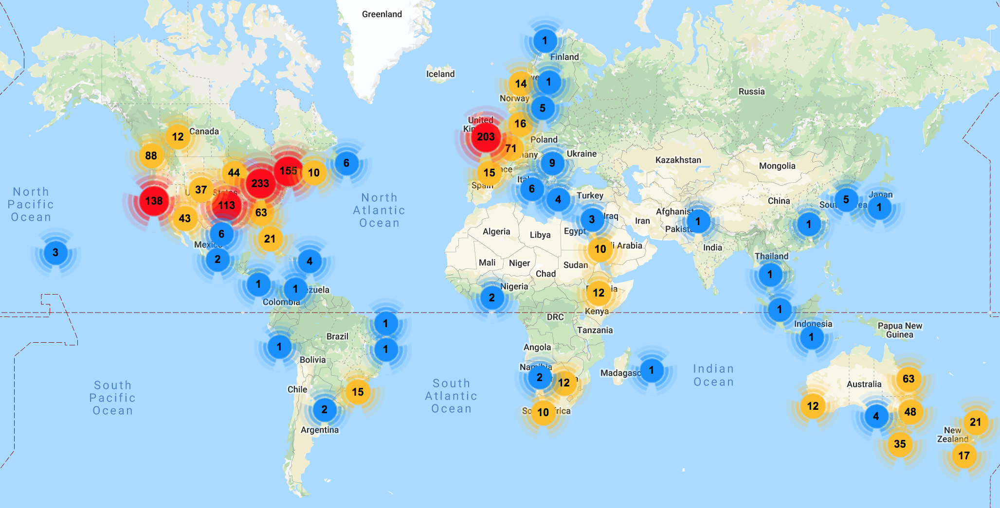
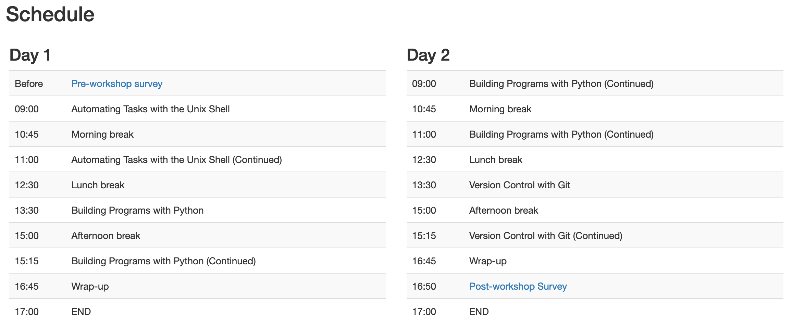
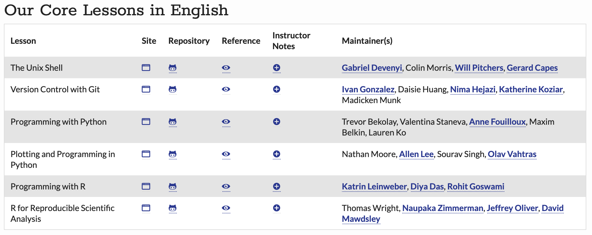
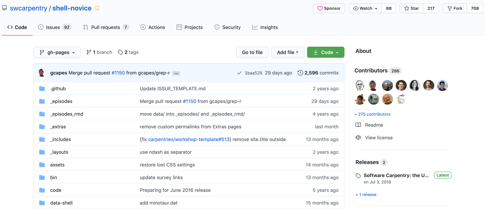
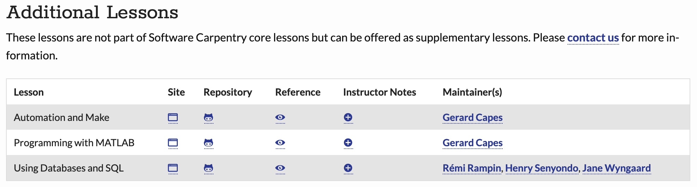
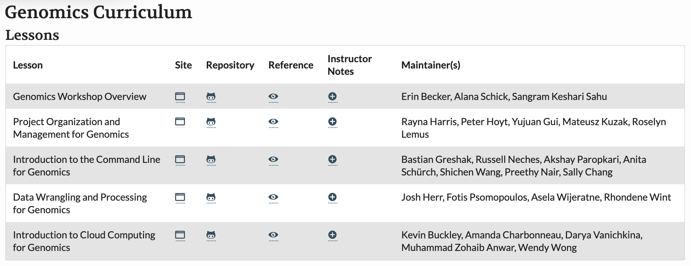
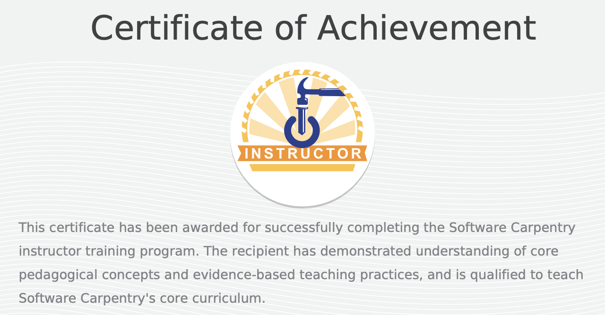
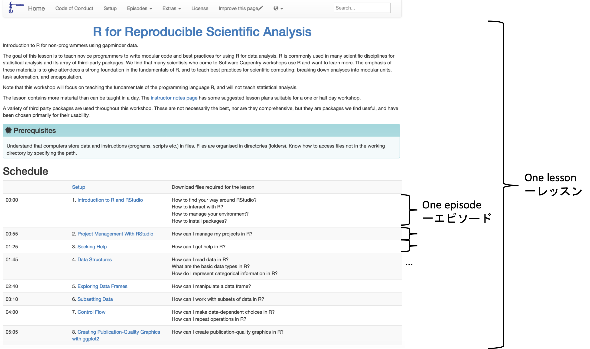
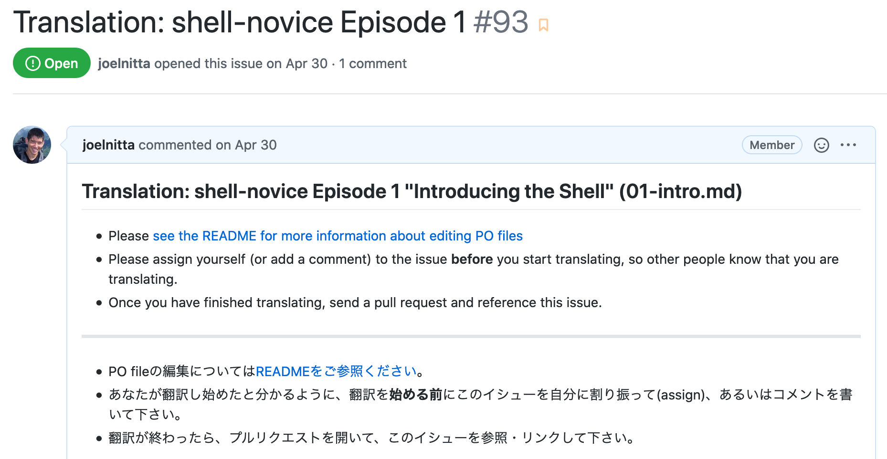
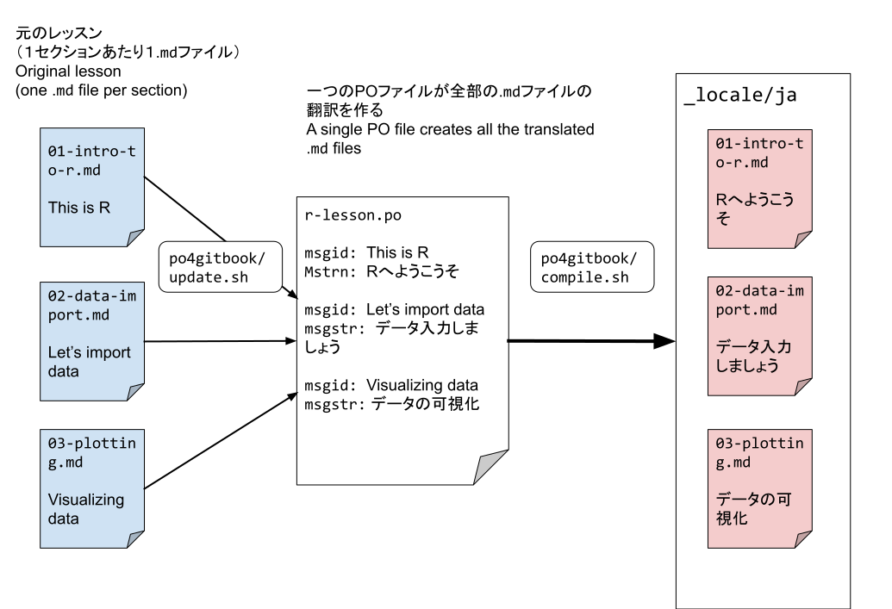

class: title-slide
background-image:url(images/title-image-2.png)
background-size: 35%
background-position: 90% 75%

<br>

# Teaching Data Skills with Software Carpentry

<br>
## Joel H. Nitta

Iwasaki Lab,<br>The University of Tokyo<br>
<span style = 'font-size: 80%;'>https://joelnitta.com</span>

Fika Seminar<br><span style = 'font-size: 80%;'>2020.11.17</span>

---
## この発表で伝いたいこと<br>What I want to tell you about today

- ソフトウェア・カーペントリーとは何でしょうか？<br>What is Software Carpentry (SWC)?

- SWCに参加すると何が得られるでしょうか？<br>What can you gain from participating in SWC?

- どうやってSWCの教材を日本語にしているのか？<br>How are we translating SWC materials in Japanese?

---

## Software Carpentry (SWC) とは？

.middle[
- 無償のコードを教えるワークショップ A free coding workshop

- ボランティアによって運営されている Run by volunteers

- 研究者にコードのベストプラクティスを教える Teaches academic researchers best practices


]

.center[https://software-carpentry.org/]

---

## 問題 The problem

- 研究者は最近コードを使えざるを得ない
Academic researchers increasingly need to use code

- ほとんどは独学で覚えている Most of them are self-taught

- が、効率はあまり高くない ...but they are not very efficient

.center[]

---

## SWCの解決法 SWC's solution

- 研究者が**コミュニティを作って**、互いに教え合う
Researchers teach each other as a **community**

- 二日間にわたるワークショップ Two-day workshop

- ３−４レッスンを教える　Cover 3-4 lessons

.center[]

---

### 1796 workshops in 54 countries since 2012



---

## ワークショップ Workshops

- 誰でも参加できる Open to anyone

- 無料か少額 Free or small charge for catering/venue

- ワークショップ前後にアンケートを実施 Survey before and after workshop

- 改善のためのフィードバックは重視されている Feedback is important to improve workshops

.center[]

---

## ワークショップ Workshops

スケジュールの例 Example schedule

（最近はオンラインになって、数日に渡って2-3時間ずつ）<br>(Recently, online sessions are 2-3 hours per day over several days)

<!-- schedule from https://edbennett.github.io/2020-02-25-cardiff/-->
.center[]

---

## レッスン Lessons

基本レッスン Core Lessons: unix, git, python, R



---

## レッスン Lessons

http://swcarpentry.github.io/shell-novice/

```{r echo=FALSE}
knitr::include_url("http://swcarpentry.github.io/shell-novice/")
```

---

## レッスン Lessons

https://github.com/swcarpentry/shell-novice


---

## レッスン Lessons

追加レッスン Additional Lessons: make, MATLAB, SQL



---

## ザ・カーペントリーズ The Carpentries

Data Carpentry, Library Carpentry, Software Carpentry


---

## データ・カーペントリーのレッスン<br>Data Carpentry Lessons



---

## インストラクター Instructors

- ボランテイア Volunteers

- 合格には講習の参加と模擬授業に基づいた試験を受ける必要がある<br>Certification after taking training course and passing live teaching demonstration

.center[]

---

## メンバー組織 Member Institutions

- SWCを広めるのに貢献する Commit to grow and spread SWC

- ワークショップ実施の支援を受ける Receive support for running workshops

- インストラクター教育の支援を受ける Receive support for training instructors

- 年会費（米ドル）Annual fee (USD): $5,000&ndash;$15,000

[Examples](https://carpentries.org/members/): California Institute of Technology, CSIRO, NASA, Stanford University, Smithsonian Institution, South African Centre for Digital Language Resources, Woods Hole Oceanographic Institution...（東大？）

---

## ワークショップの例（自分の経験）<br>Example Workshops (my experience)

[Harvard University, 2015](http://fasrc.github.io/2015-07-22_SWC-R/): クラスターを使うのに必須<br>Required to use computing cluster (Software Carpentry)

[Smithsonian Institution, 2019](https://smithsonianworkshops.github.io/2019-02-04-castle/): 博物館の研究者にデータ解析スキルを教える<br>Teach museum researchers analysis skills (Data Carpentry)

[Institute for Tribal Environmental Professionals, 2020](https://marwahaha.github.io/2020-11-04-ITEP-online/): アメリカ先住民の方々にデータスキルを教える<br>Teach tribal leaders analysis skills (Data Carpentry)

---
class: middle

# 日本でもできる？

# Can we bring SWC to Japan?

---
class: middle

# できますとも！…でも日本語の教材が必要です

# Yes! ...But we need curricula in Japanese

---

##　翻訳チーム Translation team

- 役割 Roles
  - 翻訳係（日本語ネイティブ） Translator (JA native)
  - レビュー係（日英両方わかる） Reviewer (strong EN & JA)
  - 管理係　Maintainer

.center[]

---

## アプローチ　Translation strategy

- ６レッスン　6 lessons
- １レッスンあたり10-15「エピソード」 10-15 episodes/lesson

.center[]

---

## レッスンの例 Example lesson

[R in Japanese](https://swcarpentry-ja.github.io/r-novice-gapminder/ja/index/index.html)

```{r echo=FALSE}
knitr::include_url("https://swcarpentry-ja.github.io/r-novice-gapminder/ja/index/index.html")
```

---

## アプローチ　Translation strategy

- ６レッスン　6 lessons
- １レッスンあたり10-15「エピソード」 10-15 episodes/lesson
- １エピソードあたり１イッシュー　One issue/episode

.center[]

---

## アプローチ　Translation strategy

- 英語の教材はmdファイルになっている
English lessons are md files

- POファイルで翻訳を作る
Use a PO file to generate the translation

- 更新があったら、変わった場所だけの翻訳を直せばいい
When the English version is updated, we only have to change that part

---

## アプローチ　Translation strategy



---

## 現状　Current progress

- **R (データ解析 data analysis)**: 16/16 エピソード完了
16/16 episodes complete

- R（プログラミング programming）: 0/15

- Python(データ解析 data analysis): 0/20

- Python（プログラミング programming）: 0/11

- **git: 2/14** ← 次にやる予定　Next up

- **unix: 0/7**

---

## 参加者大募集中　Looking for participants!

- Twitter: @swcarpentry_ja

- Slack: https://carpentries-jp-en.herokuapp.com/ からアクセス

- GitHub repo: https://github.com/swcarpentry-ja/i18n/

- Meetup: 二ヶ月ごとにzoomで　Every 2 months on Zoom

.center[]

---
class: center, middle

# ご清聴をありがとうございます

# Thank you!
